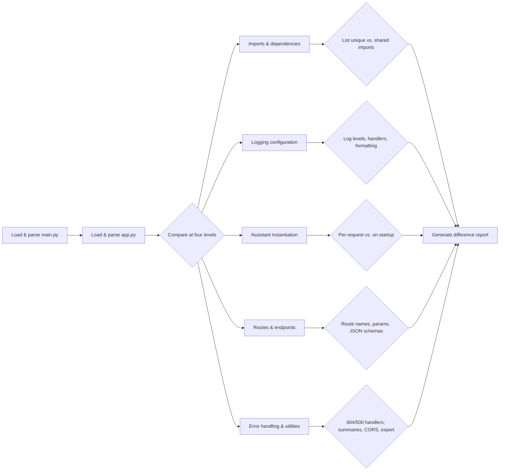

# Comparison Plan: Differences between main.py and app.py

## Step-by-step

1. **Imports & Dependencies**
   - Identify which modules each file imports (FlaskRAGAssistant, CORS, PromptEvaluator, config, llm_summary, etc.)
   - List shared vs. unique imports.

2. **Logging Configuration**
   - Compare logger setup: root vs. module logger
   - Levels: `WARNING` (main.py) vs. `DEBUG` (app.py)
   - Handlers: file, stream
   - Formatters.

3. **Assistant Initialization**
   - main.py: instantiate per request with settings.
   - app.py: instantiate once at startup.

4. **Routes & Endpoints**
   - List and compare each route (`/`, `/api/query`, `/api/eval`, `/api/system_prompt`, `/api/reask`, `/api/smash`, `/api/export`, `/api/health`, `/api/evaluate`, etc.)
   - Compare parameters, request/response structure.

5. **Error Handling & Utilities**
   - 404/500 handlers: catch-all JSON vs render_template.
   - Export/session markdown in app.py.
   - HAS_SUMMARY flag usage in main.py.

6. **Report Generation**
   - Format the comparison as a side-by-side table or bullet list summarizing all differences.