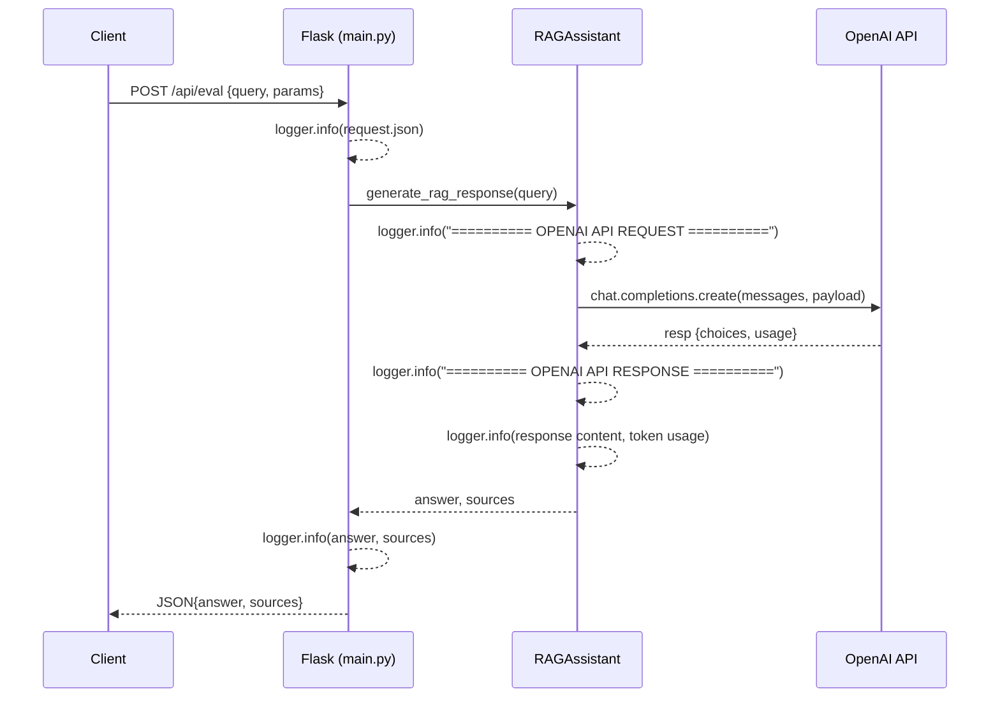

# Logging Restoration Plan

## Objectives
- Reinstate comprehensive INFO-level logging for evaluation and query requests and responses.
- Capture: original request payload, query string, model name, temperature, top_p, max_tokens, system prompt (sent vs default), raw messages array, response snippet, and any errors.
- Maintain formatting consistent with existing separators (`========== OPENAI API REQUEST ==========`).

## Scope
- **main.py** endpoints:
  - `/api/eval`
  - `/api/query`
  - `/api/reask` (optional)
- **rag_assistant.py** core chat logic:
  - `_chat_answer(...)` before and after the OpenAI call
  - `generate_rag_response(...)` to log context and evaluation results

## Detailed Steps

### 1. main.py insertion points
a. At the start of each endpoint handler, log the full `request.json`:
```python
logger.info(f"Received {endpoint_name} request with data: {request.json!r}")
```
b. Immediately after parsing parameters:
```python
logger.info(f"Mode: {mode_name}, Query={query!r}, Model={model}, Temp={temperature}, Top-P={top_p}, MaxTokens={max_tokens}")
```
c. After determining the system prompt:
```python
logger.info(f"System prompt sent: {actual_prompt!r}")
```
d. After receiving the response:
```python
logger.info(f"Answer[:100]={answer[:100]!r}, Sources count={len(sources)}")
```
e. Retain existing try/except blocks to log errors.

### 2. rag_assistant.py insertion points
a. Before the API request separator:
```python
logger.info("Raw payload: %s", json.dumps(payload, indent=2))
```
b. Immediately after the OpenAI call returns:
```python
logger.info("========== OPENAI API RESPONSE ==========")
logger.info("Response content: %s", answer)
# If usage metadata is available:
logger.info("Token usage: prompt=%d, completion=%d", resp.usage.prompt_tokens, resp.usage.completion_tokens)
```

### 3. Formatting & Levels
- All new statements use `INFO` level.
- Follow timestamp and format from `logging.basicConfig`.
- Use consistent quoting and indentation.

## Verification
- **Unit tests**: Mock `client.chat.completions.create` to return dummy response with usage metadata; assert `caplog` captures new log lines.
- **Manual tests**: 
  - `curl -X POST localhost:5011/api/eval -d '{"query":"test", ...}'` and inspect `app.log`.
  - Compare with historical logs for parity.

## Sequence Diagram


## Next Steps
1. Toggle to Act Mode and implement logging changes.
2. Run tests and perform manual validation.
3. Review `app.log` to confirm restored details.
4. Commit changes and update documentation if necessary.
